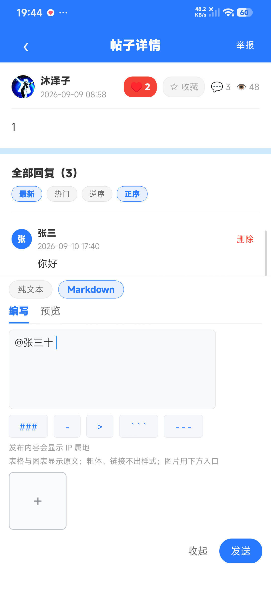
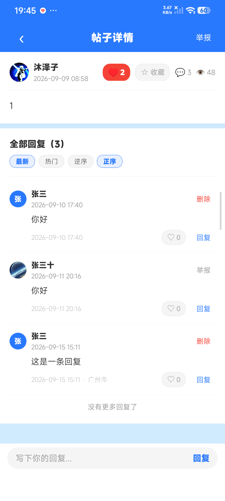

## 改了什么 / 为什么改

帖子详情页底部回复栏改为**默认收起为极简触发条、点开才展开**，避免一进页面就常驻摊开完整输入区（原生端不支持 CSS 过渡/动画，实为「展开↔收起」状态切换）。顺带修复该改动暴露的「点某条评论的『回复』预填 @作者 不显示」时序问题。

无关联 issue（来自直接需求）。

## 改动类型
- [x] feat（新功能）

## 影响范围 / 风险点

- 仅 `training-app/…/pages/forum/forum-detail.uvue`（+103 / −19）。**未触碰共用组件 `forum-markdown-input`**（发帖表单零影响）。
- 无数据库 / 接口变更；不触及打包面（④b 免）。
- [ ] 本次改动触及「agent 观测不到的能力面」—— **否**（纯 UI 状态切换，无指纹 / 运行时权限弹窗 / 真机上传 / 厂商 ROM 交互）→ **①b 免**。

## 验收证据

- ① Android 真机逐页截图对比（**①a**：agent 出证） — 执行人：agent 执行 · 日期：2026-09-23 · 复测对象：forum-detail 回复栏（小米 marble / Android，uni-app-x 基座） · 结论（含产物）：真机实测两条均通过 —— 点某条评论「回复」→ 展开并预填 `@张三十`（作者名一字不差）；展开态下滑回复列表 → 自动收起回极简触发条。shot1： shot2：；另跑只读 `device-capture` 取 logcat 无崩溃机检行（`FATAL EXCEPTION=0 / ANR=0 / E AndroidRuntime=0`，产物 `.ci-verify/device-capture.log`；该脚本因本机 dumpsys 未暴露 `mResumedActivity` 而整体判 FAIL，属取前台 Activity 的解析 quirk、非崩溃，且 device-capture 本就非门）
- ② 微信开发者工具无报错（半自动） — 执行人：（**待人工签收**，agent 不代填） · 日期： · 复测对象： · 结论：待跑 `scripts/mp-weixin-check.ps1 -PostToPr <本PR>`（需微信开发者工具登录态），产出 `MP_WEIXIN_RESULT` + 截图后由人给出执行人原文。
- ③ `npm run test:unit` 全绿 — 结论：CI `mobile-test` 全绿（run 链接 https://github.com/DriftingLi/FL/actions/runs/35856785585/job/107167109240 ），`ci-summary` pass。
- ④ 本地编译门 ④c `npm run build:kotlin-all` — 执行人：agent 执行 · 日期：2026-09-23 · 复测对象：全量 Kotlin 编译 · 结论：**④c 通过**，`KOTLIN_ALL_RESULT errors=0 classes=1501 files=120`（产物 `.ci-verify/kotlin-all.log`），已贴 PR ④ 门评论（sha 绑定 `ce24356`），见评论。

> **合并前置**：仅剩 **② 人工签收**（需微信开发者工具登录态 + 人给执行人原文）；①a / ③ / ④ 均已落。② 补齐前**不合并**。

## 自检清单
- [x] 提交信息遵循 Conventional Commits
- [x] 一个分支只做一件事，可独立 revert
- [x] 未把其他会话/模块的改动夹带进来
- [ ] 已关联对应 Issue（无对应 issue，来自直接需求）
